<h1 align="center">Dhruv Jain 👋</h1>

  

  
  &nbsp;&nbsp;
  
  &nbsp;&nbsp;
  

---

## 📊 Live Learning Dashboard

<!--START_SECTION:live_dashboard-->
| Repository | Latest Activity | Updated |
|------------|----------------|---------|
| [CPP-DSA-Leetcode](https://github.com/jaindhruv04/CPP-DSA-Leetcode) | Time: 0 ms (100.00%) - Memory: 10.5 MB (50.33%) - LeetSync | 2026-08-27 |
| [dhruv-portfolio](https://github.com/jaindhruv04/dhruv-portfolio) | Refine experience and leadership copy | 2026-08-26 |
| [careeros](https://github.com/jaindhruv04/careeros) | Refactor error handling in controllers and middleware; remov | 2026-08-26 |

<!--END_SECTION:live_dashboard-->

---

## 💻 Current Language Focus

  

---

## 🛠️ Tech Stack

  

---

## 📈 GitHub Analytics

<!--START_SECTION:github_analytics-->
<table align="center">
<tr>
<th>Metric</th>
<th>Value</th>
</tr>
<tr>
<td>Total Commits</td>
<td>274</td>
</tr>
<tr>
<td>Current Streak</td>
<td>2 days</td>
</tr>
</table>
<!--END_SECTION:github_analytics-->

---

## 🐍 Contribution Snake

  

